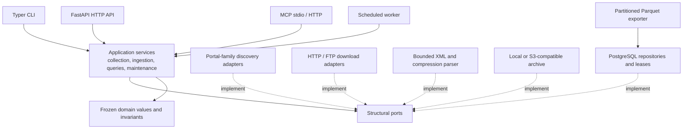
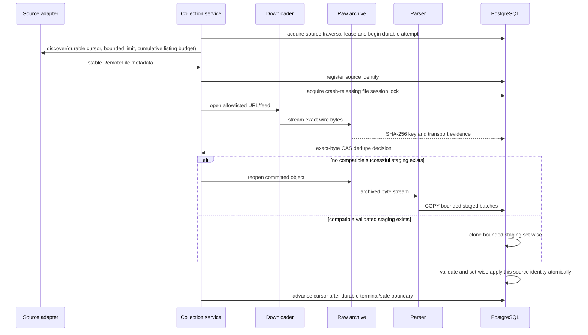

# Architecture

Makolet is an asynchronous Python modular monolith. One composition root builds the
same application services for CLI commands, the HTTP API, MCP, and the worker. The
design keeps network discovery, exact-byte download, archival, parsing, persistence,
and presentation separate so each hostile boundary can be tested independently.

## Layers and dependency direction

`src/makolet/domain/` imports no database, HTTP, CLI, MCP, worker, or retailer code.
`application/` contains use cases and `Protocol` ports. `adapters/` contains I/O and
framework implementations. `interfaces/` owns transport validation and rendering.
`composition.py` is the production wiring boundary.

## Collection and ingestion flow

Discovery never downloads business bytes. Downloading never parses them. Parsing has
no network access and parses only committed archive objects. PostgreSQL stores each
remote identity and its immutable apply time separately. Exact bytes may share one
raw CAS object and compatible validated staging, while unchanged normalized values
suppress history events rather than suppressing source chronology.

## Runtime composition

`open_runtime()` creates one SQLAlchemy async engine, one bounded HTTP client, source
registry, HTTP/FTP downloader router, configured archive, parser, ingestion/query
repositories, catalog-matching service, lease manager, worker, metrics registry, API
application, MCP server, and Parquet export operation. Resource shutdown closes the
HTTP client, S3 client, and database engine.

Archive selection is configuration-driven:

- `local` writes read-only objects beneath `MAKOLET_ARCHIVE_ROOT` using atomic
  create-if-absent hard links;
- `s3` uses an S3-compatible endpoint, conditional `If-None-Match: *` writes, and
  read-back SHA-256 verification. Compose uses Apache-2.0 SeaweedFS.

Synchronous FTP, filesystem, S3 client, and export operations are isolated behind
bounded adapters. Deadline-sensitive archive and export mutations use supervised,
killable child processes; safe bridge calls may use bounded threads. Async queues,
cumulative listing requests/bytes/time, discovery pages, parser batches, file sizes,
record counts, redirects, and public query results all have explicit limits.

## Operational data and queries

PostgreSQL 18 is the single operational source of truth. UUIDv7 values are internal
identities; retailer codes, store codes, item codes, and GTINs are alternate
identifiers. Current price/availability tables support common reads, while half-open
validity rows retain only changes. Full snapshots can reconcile absence only after
minimum-count and maximum-drop checks; deltas touch only named records.

PostgreSQL-generated NFKC search columns plus `pg_trgm` support Hebrew, Latin, mixed,
punctuation-normalized, and exact validated-barcode lookup. Queries use keyset cursors
and deterministic tie-breakers. Retailer item-code lookup uses an exact normalized
code plus a required retailer UUID, so a publisher identifier never acquires an
implicit global scope. Completed ingestion automatically creates an isolated
one-retailer-item canonical representation for otherwise unmatched SKUs. Bounded
operator candidate generation uses identifier equality and indexed trigram blocks;
structured/fuzzy matches remain review-only. No arbitrary SQL is exposed.

Archive maintenance is an application use case over explicit persistence ports. Date
replay selects a bounded deterministic page and invokes only archive verification,
parse, and apply. A full normalized rebuild durably snapshots its file sequence,
stable logical rows, UUIDs, provenance, and reviewed decisions, then activates a
database maintenance barrier. Curated catalog and matching rows remain in place;
archive-derived observations, assertions, relations, watermarks, staging, and apply
state are reset transactionally and replayed at their original apply times. Each file
is checkpointed only after its catalog bootstrap completes. Ordinary apply takes the
barrier lock and fails closed; only replay linked to the active rebuild may proceed.
The final transaction reconciles stable identities and proves exact equivalence for
an unchanged parser before clearing the snapshots and barrier. Parser-correction runs
instead retain the original snapshot with preservation/supersession outcomes. This is
intentionally an in-place downtime operation, not a shadow swap; status exposes
partial reads until completion.

Parquet exports are reproducible analytical copies of `current_prices` and
`price_history`, partitioned by entity, retailer, and UTC date. One repeatable-read,
read-only database snapshot governs partition discovery and row streaming, preventing
mixed-state datasets during concurrent ingestion. Rows embed portal/source/archive
provenance needed to resolve the exact raw object. They are not a second operational
truth.

## Security and observability boundaries

- Portal-specific host/scheme/port allowlists and DNS public-address checks constrain
  SSRF; redirects are manual and bounded.
- Exact response bytes are bounded independently from decompression. ZIP paths,
  symlinks, encryption, extra members, truncation, and expansion ratios are checked.
- XML rejects HTML error pages, DTDs/entities, excessive depth/elements/records/field
  sizes, malformed encodings, and unsafe Expat versions.
- SQL is parameterized; API/MCP query lengths, ranges, cursors, bodies, and page sizes
  are bounded.
- Structlog emits JSON on stderr with context identifiers and recursive secret/URL/log
  injection redaction. API and continuous-worker processes expose their separate
  in-memory Prometheus registries at `/metrics`; the worker also exposes `/healthz`.

## Technology decisions

See the versioned ADRs:

- [0008 — stable-identity in-place rebuild](adr/0008-stable-identity-in-place-rebuild.md)

- [0001 — Python application stack](adr/0001-python-application-stack.md)
- [0002 — modular monolith and ports](adr/0002-modular-monolith-and-ports.md)
- [0003 — PostgreSQL current state and history](adr/0003-postgresql-current-state-and-history.md)
- [0004 — content-addressed raw archive](adr/0004-content-addressed-raw-archive.md)
- [0005 — database-native product search](adr/0005-database-native-product-search.md)
- [0006 — direct MCP protocol core](adr/0006-direct-mcp-protocol-core.md)
- [0007 — dependency-free Parquet subset](adr/0007-dependency-free-parquet-subset.md)
