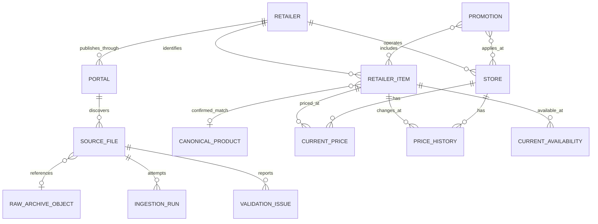

# Data model

The model keeps publisher identities, auditable source files, retailer-specific
catalog entries, canonical products, current observations, and historical changes as
different concepts. This separation prevents a publisher code or plausible fuzzy
match from becoming an irreversible global identity.

## Core relationships

The diagram omits staging, candidate matching, event, and replay tables for clarity;
the complete inventory is in the [data dictionary](data-dictionary.md).

## Identity rules

- UUIDs are durable internal primary keys. PostgreSQL 18 generates UUIDv7 by default.
- A retailer `source_key`, portal `source_key`, source `remote_id`, source store code,
  retailer item code, and GTIN are alternate identifiers with explicit scope.
- Stores, store aliases, retailer items, source watermarks, and promotion identities
  include the originating portal. Two feeds owned by one legal retailer group cannot
  silently merge equal publisher codes.
- One `retailer_item` belongs to one retailer and preserves that publisher's fields.
  It is not itself a universal product.
- A `canonical_product` is connected through `confirmed_product_matches`. One
  checksum-valid GTIN assertion is retailer-scoped provisional evidence; global GTIN
  validation requires independent retailer corroboration. Automatic post-ingestion
  bootstrap may create a one-item `isolated_retailer_item` canonical representation,
  which is not a cross-item merge.
- Exact normalized non-GTIN identifiers and name/brand/manufacturer/quantity/unit/
  packaging similarity create reviewable `product_match_candidate` rows with bounded
  scores and explanations. They never silently merge products.
- Accepting a candidate transactionally replaces only the subject's system-isolated
  mapping, records auditor/time, supersedes its other pending candidates, and retires
  an unreferenced isolated product. A conflicting manual/non-isolated mapping is never
  overwritten. Reject and supersede states retain their review metadata.
- Fuzzy search ranking never merges products.

## Raw provenance

`source_files` retains the stable remote identity, original URL/filename, retailer,
portal, inferred document/compression/protocol, source/discovery/download timestamps,
safe response metadata, parser version, archive reference, status, and safe error.
The exact byte object is deduplicated by SHA-256 in `raw_archive_objects`; two remote
identities may reference the same object without losing their individual provenance.

`ingestion_runs`, `source_file_events`, `validation_issues`, and `replay_runs` make
processing auditable. `applied_source_contents` is the immutable per-source apply-time
ledger; raw-object SHA-256 supplies byte deduplication. `normalized_rebuild_runs`, its
ordered file rows, durable stable-identity snapshots, and the singleton maintenance
control record make an in-place archive rebuild restartable and expose when normalized
query state is partial. The snapshots cover public/cursor-bearing temporal rows and
reviewed matching decisions as well as the durable catalog identities to which replay
must reconnect.

Archive date replay is ordered by the source file's download-finish/archive-attachment
timestamp and UUID, not by the content object's first archival time. This distinction
preserves correct date windows when later source files deduplicate to older exact
bytes.

## Current state and history

`current_prices` and `current_availability` contain one row per retailer item/store.
They preserve first/last observation times and the latest source file. History uses
half-open intervals: `valid_from` is inclusive and `valid_to` is exclusive/null for
the open value.

When a price or availability value changes, apply closes the open history interval
and opens another. An unchanged observation only advances current observation
metadata; it does not create another history event. Price and availability are
tracked independently.

An ordinary parser-unchanged normalized rebuild reuses each source file's immutable
original apply time, restores the exact current/history UUIDs and interval boundaries,
and fails closed if the regenerated logical rows differ. Stores, aliases, retailer
items, canonical products, identifier groups, and reviewed catalog/match decisions
remain in place, so replay cannot overwrite reviewed canonical fields. A deliberate
parser correction may supersede affected derived rows with new identities; its
original snapshot remains with per-row outcomes, and byte-equivalent analytical
exports are not expected for that correction run.

## Full snapshots and deltas

- `price_delta` and `promotion_delta` apply only records present in the file.
- `price_full`, `promotion_full`, and `stores` are eligible for absence reconciliation
  only after parsing/staging succeeds and configured minimum-count/drop-fraction
  checks pass inside the apply transaction.
- A malformed, truncated, empty, HTML, suspiciously small, or structurally unsafe
  file is quarantined or failed and cannot become a successful empty snapshot.

This behavior is described step by step in
[the ingestion lifecycle](ingestion-lifecycle.md).

## Money, quantity, and time

Money is PostgreSQL `numeric(14,4)` and Python `Decimal`; floating point is not used
for source prices. Quantities are `numeric(18,6)`. Discount rates are
`numeric(10,6)`. Source values that cannot be fully normalized are preserved in
descriptive/remarks fields where the format supplies them.

All operational timestamps are timezone-aware and stored as `timestamptz`. Naive
publisher timestamps are interpreted as `Asia/Jerusalem` and normalized to UTC at
boundaries only when the local wall time maps to one UTC instant. A timestamp in the
spring DST gap is nonexistent; one in the autumn fold is ambiguous. Both become a
categorized record rejection when they occur in business records unless the
publisher supplies an explicit numeric offset. Invalid optional listing
`last_modified` evidence is omitted instead of failing discovery. Explicit offsets
are retained as the authoritative instant before UTC normalization.

## Promotions

A promotion has a publisher identity and store scope, validity window, structured
discount kind, quantity/rate/purchase/price conditions, original restrictions and
remarks, active state, and a content fingerprint. Join tables represent multiple
eligible items, stores, and clubs; `is_gift` and source item type remain available.
Changing a promotion closes its validity row and opens a new fingerprinted row rather
than overwriting the prior state.

The XML normalizer has a per-family allowlist of observed clean-room leaf aliases
and structural paths. Only direct record fields and the explicitly supported
promotion/store relationship paths populate business values; a familiar leaf below
an unknown wrapper cannot shadow a legitimate direct field. Additive wrappers,
leaves, and attributes emit bounded `unexpected_xml_field` warnings, while a wrong
root or displaced record container fails the document closed. For a promotion,
bounded name/value evidence is also appended to `additional_restrictions`, so a new
coupon or eligibility condition cannot silently vanish from public terms. A renamed
required field still rejects the record; raw bytes remain the authoritative replay
evidence in either case.
