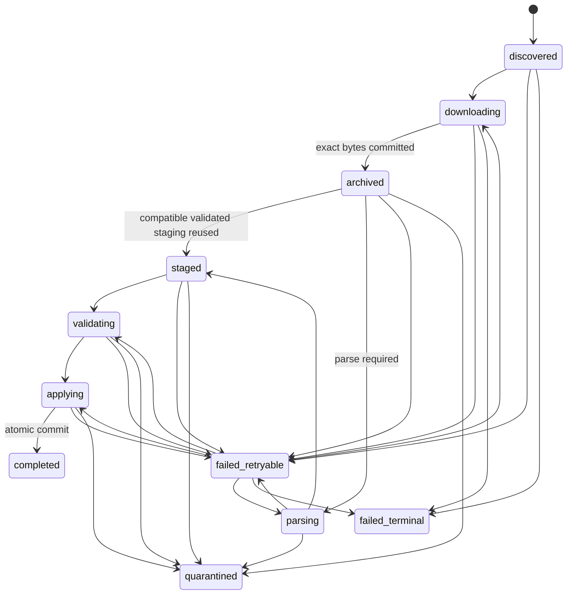

# Ingestion lifecycle

Ingestion is organized around one stable `source_file` identity and one exact archive
object. It is idempotent at both levels: rediscovering the same portal/remote ID reuses
the source-file row, while a distinct later identity that carries the same bytes gets
its own apply chronology. Compatible successful staging can be reused without parsing;
unchanged normalized values do not create duplicate history events. Rediscovery
preserves the first discovery time and existing listing evidence. Before archival it
may fill a previously absent optional evidence field; after archive attachment that
evidence and chronology are frozen. Before archive attachment, only the worker that
holds the per-file lock may rotate an HTTPS signed-query URL whose origin, path, and
non-signature parameters are unchanged. Unowned rediscovery is read-only.
Conflicting identity or listing evidence fails closed, while completed duplicates
retain their original metadata. Later listing health belongs to the separate durable
collection attempt, and public status never exposes credential-bearing URLs.

## Happy path and duplicate path



Every transition is checked by the domain state machine and recorded with its
ingestion run. Completed, quarantined, and terminal-failure source files are terminal
in the ordinary lifecycle; replay has its own `replay_runs` audit record.

## Step-by-step behavior

1. A source adapter returns a bounded `DiscoveryPage` of `RemoteFile` metadata. The
   remote ID is stable even when the download URL contains an expiring signature.
   One explicit budget follows the entire source run through every adapter and
   transport call: by default at most 256 listing requests, 8 MiB of cumulative
   listing bytes, and 300 seconds of listing work. Redirects and resolver calls are
   requests; terminal, out-of-range, duplicate, and unknown pages consume the same
   budget. Exhaustion ends the attempt as a resumable bounded discovery result at its
   last committed cursor/offset; the immediate result reports cumulative listing
   request and retained-byte counts. Matrix keeps its one whole-catalog response for
   subsequent in-run offset pages instead of refetching it.
   Before requesting the first page, collection acquires one source traversal lease
   and opens a durable attempt at the ordinary or exact backfill-range checkpoint.
   The checkpoint is bound to the retailer, sorted portal set, portal-generation
   hash, operation, range, and archive-only mode, so publisher cursors cannot cross
   sources, configuration generations, or collection modes.
2. PostgreSQL upserts `(portal, remote_id)` and creates the first ingestion run/event
   when the identity is new. Before network I/O, collection durably reserves the
   maximum charged bytes permitted for that attempt/source identity. An already
   completed identity returns immediately.
3. The worker acquires `source-file:<UUID>` through a PostgreSQL session advisory
   lock held on an unpooled connection that inherits the process database TLS policy,
   UTC session setting, and configured statement timeout for the complete file
   ingestion or replay boundary. It has no time-based takeover: a second owner
   receives a retryable `lease_unavailable` error even when supported parsing/apply
   work is long.
   All source-file database mutations use that same owning connection in short
   transactions; an inherited stale task therefore cannot fall back to the pool after
   its lock session closes or a new owner takes over.
   Normal exit and cancellation explicitly unlock; process/connection death releases
   the session lock. Stale-job recovery must acquire the same lock before changing
   lifecycle state.
4. If the row has no archive object, the protocol router downloads it. HTTP uses exact
   `aiter_raw()` bytes, connects to a validated public address with the logical
   hostname/SNI, and has one total deadline across redirects and streaming. FTPS
   verifies the publisher certificate and spools a bounded exact file. Plain FTP is
   blocked unless the operator explicitly opts into unauthenticated transport.
   Every ordinary download receives a finite cumulative byte ceiling. An HTTP(S)
   reservation covers the object plus 64 KiB of transport-frame headroom; an
   FTP/FTPS reservation additionally covers the bounded 256 KiB control
   channel, four vetted-address attempts, and TLS 1.3 record framing through
   the 16 GiB object ceiling.
   Retries share that ceiling. The underlying HTTP iterator or FTP callback can
   receive one final frame that crosses the logical object cap; its full wire length
   is charged, the frame is never archived, and settlement remains within the
   durable reservation. HTTP is explicitly rechunked and FTP rejects configuration
   above that shared frame bound. The terminal retry boundary is the only path with
   no downloader limit because it performs no network I/O.
   Retryable network errors receive at most four attempts with randomized exponential
   backoff only after prior response/socket work has terminated.
5. The archive hashes while streaming, commits create-if-absent under
   `sha256/aa/bb/<64-hex-digest>`, and then PostgreSQL records byte count and safe
   transport metadata. Collection atomically settles the reservation to immutable
   archive bytes plus failed/retried transfer overhead. Memory and PostgreSQL
   persistence refuse an exact charge above the reservation before changing its
   settlement or budget state. A process death or ambiguous
   post-CAS failure leaves the conservative reservation charged rather than guessing
   that no bytes were retained. Parsing has not started yet.
6. Every distinct source identity retains its own immutable apply chronology even
   when its exact bytes already exist in the content-addressed archive. If a prior
   successful file has the same bytes and exact parser/document/compression context,
   PostgreSQL may clone its fully validated staging rows set-wise; otherwise the
   service reopens and parses the committed object. Staging from failed, quarantined,
   incomplete, or differently versioned parsing is never reused.
7. Parsing decompresses/decodes the archive and sends events to PostgreSQL in batches
   capped at 5,000 prospective persistence rows and 64 MiB of conservative retained
   memory. A promotion charges its parent plus item, deduplicated effective-store,
   and club relationship rows; its source-scoped store is counted even when it is not
   listed in `store_ids`. A single event that exceeds either ceiling is quarantined
   before batch admission. Record-level domain errors become structured
   `record_rejection` issues; malformed files and unsafe containers fail the file.
   Repeated unchanged values advance observation/provenance but do not create
   value-history events.
8. Staging is validated. Any `file_quarantine` issue stops apply. PostgreSQL then
   validates document-specific completeness/relationships and applies set-based SQL
   in one logical transaction.
9. Current state, change history, promotion relationships, content idempotence, counts,
   and completion status commit together. A rollback cannot leave an apparently
   completed partial apply.

Collection advances its publisher cursor and in-page offset only after each identity
is already terminal or the requested archive/apply operation reaches a durable safe
boundary. A retryable failure therefore leaves the checkpoint before that file; an
interruption retries it without skipping. If the source file committed but required
catalog post-processing did not, the next attempt idempotently replays that exact
uncommitted boundary; terminal identities already behind the checkpoint do not
repeat. The per-run file cap counts eligible processed files, not out-of-range catalog
entries, so a late range cannot be starved by a large catalog prefix. A
completed traversal rolls to a new generation on the next run: existing terminal
identities are skipped and newly published identities are collected.
Independent 100,000-record and cumulative listing-work ceilings bound even an
endlessly paginated or entirely out-of-range adapter; their committed checkpoint
resumes on the next run, so a ceiling delays but does not permanently starve later
in-range identities. The durable truncation taxonomy records listing-work exhaustion
as `discovery_limit`; the immediate collection result retains the exact request,
byte, or elapsed cause.

Unknown document/compression entries advance the traversal with durable warning
counts. A mixed listing continues, an all-unknown non-empty generation fails closed,
and a genuinely empty listing succeeds. Each attempt stores start/finish time, safe
error, discovery/processing/duplicate/warning counts, truncation, and its final
checkpoint. `source-status` returns the latest attempt alongside the latest and last
successfully applied file for each portal.

## Hostile input and resource bounds

The default archive limit is 2 GiB compressed/exact bytes. Decompression is separately
bounded to 8 GiB, a 250:1 expansion ratio enforced before each emitted chunk, 16 ZIP
entries, a 4 MiB ZIP central directory, and one non-directory ZIP payload. A bounded
EOCD/central-directory preflight rejects excessive entries, ZIP64, multi-disk, and
invalid offsets before Python materializes `ZipInfo` objects. ZIP traversal, symlinks,
encryption, inconsistent lengths, concatenated Gzip/Zstandard frames, and truncation
are rejected. ZIP members are admitted only for the observed STORE and DEFLATE
methods; BZIP2, LZMA, Zstandard, and unknown methods are rejected before their
decoders can allocate a dictionary or history window. Zstandard decoder history is
independently capped at window log 27
(128 MiB) before output decoding, so a small frame header cannot request the format's
2 GiB maximum history allocation ahead of the byte and expansion-ratio checks. XML
encoding and compressed ZIP spools share the persistent
`MAKOLET_ARCHIVE_ROOT/.parser-spool` directory and are removed after each parse.
Local archive, FTP, S3, XML, and ZIP spill writes sharing `MAKOLET_ARCHIVE_ROOT`
also share its persistent `.makolet-capacity.lock`. The advisory cross-process guard
holds the free-space check, one flushed bounded chunk, and a post-write check as one
critical section; a rejected or failed temporary file is removed. Other host
applications do not participate in this application-owned lock and need separate
volume isolation or capacity controls.

The XML parser supports UTF-8 (with/without BOM), Windows-1255 (including an incorrect
declaration discovered from the complete stream), and UTF-16 with/without BOM. UTF-32
is rejected. Before Expat receives decoded text, an incremental lexical guard enforces
64 Ki characters per unfinished token and 10,000 characters per text or attribute
field. The structural parser enforces depth 64, 20 million elements, 5 million records,
2 MiB per record, a safe Expat version, and the declared document-type grammar
(`Root` plus the matching Stores/Items/Promotions container and direct record child).
HTML error pages even after an XML declaration, DTD/DOCTYPE/entity declarations,
malformed XML, and incomplete or wrong roots are file errors.
Nested Chain/SubChain/Stores wrappers use lexical context: leaving one sibling
wrapper restores its parent's chain/subchain values before the next sibling is
parsed, so a store cannot inherit identifiers from an earlier subtree. Every nested
SubChain containing Stores must declare its own direct, non-empty `SubChainID`; a root
default or previous sibling cannot satisfy it, and omission is a file-level error
before records from that scope are accepted.

These are safety ceilings, not recommended normal file sizes. They can only be changed
with matching hostile-input tests and operational review.

## Full snapshots versus deltas

`price_delta` and `promotion_delta` update only records named in the source document;
absence has no meaning. Full documents are allowed to reconcile missing rows only
inside the successful apply transaction.

For full price and promotion snapshots, apply verifies at least
`MAKOLET_INGESTION_MINIMUM_FULL_RECORDS` and rejects a count drop greater than
`MAKOLET_INGESTION_MAXIMUM_FULL_SNAPSHOT_DROP_FRACTION` against the relevant existing
scope. A full Stores document is a portal-wide roster: its guard compares the entire
incoming portal count with every active portal store, including zero rows from an
omitted subchain. If accepted, every portal-scoped absent store is deactivated in the
same transaction; a suspicious drop rolls back without partial deactivation. Store
snapshots use the same configured minimum/drop policy. Defaults are one record and 50
percent. Parser failure, validation/quarantine issues, or a failed transaction
prevents reconciliation entirely.

Unchanged price and availability observations update last-observed metadata without
opening a history row. A changed value closes the prior open interval and inserts a
new interval. Full-price absence sets current availability false and records the
availability change; it does not delete the retailer item or price history.

## Replay and recovery

```text
uv run makolet ingest replay <source-file-uuid> --json
```

Replay requires an archived key and SHA-256. It acquires the same non-expiring
session lock, refreshes the source row, verifies the complete object, records
requested/previous parser versions, clears/rebuilds that file's staging rows, and
runs validate/apply without redownloading. If process death left an open replay audit
row, the next lock owner first closes it as interrupted before creating the new
attempt, so only that owner can clear, stage, finalize, and apply. The original
source-file lifecycle remains intact; success or failure is recorded in `replay_runs`.

One bounded date-range page uses:

```text
uv run makolet ingest replay-range --since 2026-08-01T00:00:00Z --until 2026-08-02T00:00:00Z --limit 50 --json
```

The range is half-open `[since, until)` over each source file's own
download-finish/archive-attachment timestamp. Ordering is that timestamp followed by
source-file UUID, and the returned cursor resumes strictly after the last completed
page member. The maximum page is 200 files. Processing is sequential and fail-fast;
rerunning a page is safe and creates explicit replay audit records rather than
redownloading bytes.

### Normalized-state rebuild

The operator-confirmed rebuild first records a durable run and a fixed ordered list
of every eligible archive-backed completed or archive-only source file. Previously
applied files retain their original apply time and parser version; archive-only files
use their immutable effective source time. In the same transaction it snapshots the
stable catalog/matching and raw-derived rows, activates the maintenance barrier, and
clears only the archive-derived observations, assertions, relations, watermarks,
staging, and content-claim state. Stores/aliases, retailer items, canonical products,
identifier groups, reviewed identifiers, accepted/rejected/superseded candidates,
and manual/isolated confirmed matches remain in place.

Only replay attempts linked to the active rebuild may apply while the barrier is
active; ordinary collection, ingestion, and replay fail closed before download and
again inside the apply transaction. Each successful source file advances a durable
sequence cursor only after any isolated-catalog bootstrap succeeds. Failure marks the
run failed but deliberately leaves the barrier and original snapshots in place, and
resuming the same run starts at its first uncompleted file. A replay committed just
before interruption remains idempotent when that uncheckpointed file is retried.
Archive hash verification, parsing, validation, and apply are reused; discovery and
download are never invoked.

At completion, an unchanged-parser run reconciles regenerated observation, interval,
promotion-version, assertion, watermark, apply-ledger, and relation identities to
their original UUIDs and timestamps. Exact row equality is required before the
snapshots and barrier are removed; existing public cursors and deterministic Parquet
rows therefore remain valid. A logical conflict rolls back completion and leaves the
barrier active. A deliberate parser correction may supersede affected derived rows
without deleting its original evidence: original snapshots remain labeled
`preserved` or `superseded`. Archive-only input may expand the read model and follows
the same retained-audit path.

This is an in-place rebuild, not a shadow-schema swap. Public normalized reads can be
partial until completion, and status interfaces expose that warning. Follow the
explicit backup/downtime procedure in the
[operations runbook](operations-runbook.md#normalized-state-rebuild). Do not make
concurrent normalized edits inside the maintenance window; final equivalence rejects
them rather than silently choosing a winner.

The worker periodically considers at most 1,000 source files left in an active state
past `MAKOLET_WORKER_STALE_AFTER_SECONDS`. It first tries the file's session lock;
only an unowned file moves to `failed_retryable` with code `stale_job_recovered`.
Long active work is not relabelled. The next ordinary collection can resume from
archived bytes when present.

## Failures and quarantine

- Retryable `MakoletError` failures become `failed_retryable`.
- Malformed documents, unsafe archives, or staged file-quarantine issues after archive
  become `quarantined`.
- Other unexpected/non-retryable failures become `failed_terminal`.
- Safe error code/message and transition history are stored; credentials, document
  bodies, and arbitrary response headers are not.

Inspect state with `makolet failures`, `makolet quarantine list`, and
`makolet quarantine inspect`. Use the [operations runbook](operations-runbook.md)
before replaying or changing a completeness threshold.

## Metrics

The service records file/download/completion/archive-deduplication/replay/failure counters,
staged/rejected/warning record counters, exact-byte histograms, and end-to-end,
download, parsing, and database-apply duration histograms. Worker telemetry records
heartbeat time, active sources, and last-run health. Metric names are documented in
the [operations runbook](operations-runbook.md#metrics-and-logs).
